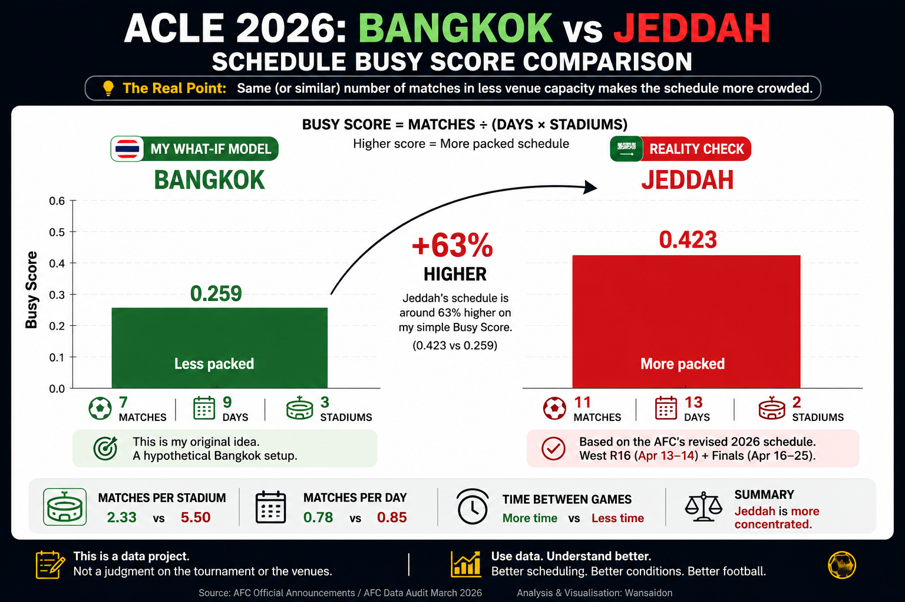

# ⚽ ACLE 2026 --- When a Football Plan Became a Data Project

> **I booked a Bangkok holiday, football in the region was disrupted,
> and I thought: "What if ACLE has to change its plan?"**

That's how this project started.

Not from work.

Not from school.

I just wanted to watch some football. 😂

------------------------------------------------------------------------

## ✈️ The Original Idea

My main plan was simple:

**Bangkok holiday: April 26 -- May 1.**

Football was only supposed to be a bonus.

But with the war involving Iran disrupting football in the region,
matches had been postponed and the calendar was getting tighter with the
World Cup approaching.

That made me wonder:

> **Could ACLE change its format, dates or location?**

Since I was already going to Bangkok, my brain naturally went:

> **"Eh... what if they move it there?"** 😂

So I built a simple **Bangkok what-if model**.

------------------------------------------------------------------------

## 🇹🇭 My Guess vs Reality 🇸🇦

My Bangkok idea was never an official prediction.

It was a question:

> **If the tournament had to change, what could another setup look
> like?**

Then reality arrived.

The remaining plan stayed centred in **Jeddah, Saudi Arabia**, with a
different setup from what I had imagined.

And then came the best part.

**Final: April 25**

**My arrival: April 26**

I missed it by **one day**. 😂

So the final score was:

**Holiday:** ✅ Success\
**Football bonus:** ❌ Failed\
**Unexpected data project:** ✅ Unlocked

------------------------------------------------------------------------

## 🤔 The New Question

Instead of deleting my failed idea, I decided to compare it with what
actually happened.

That created a much better question:

> ## **How does the number of matches, stadiums and days affect how packed a tournament schedule becomes?**

Now I had two things to compare:

**🇹🇭 Bangkok** --- my what-if model

**🇸🇦 Jeddah** --- the actual plan

The goal isn't to prove that my idea was better.

**The goal is to see what the numbers say.**

------------------------------------------------------------------------

## 📊 What Can I Compare?

**⚽ Matches**\
How many games are played?

**🏟️ Stadiums**\
How many venues share those games?

**📅 Days**\
How much time is available?

**⏱️ Time Between Games**\
How long before the same stadium is used again?

**📍 Matches Per Stadium**\
Which venue carries the biggest load?

These simple numbers can show whether one schedule is more packed than
another.

------------------------------------------------------------------------

## 🔍 What Am I Trying to Find Out?

The analysis can answer questions like:

**Which stadium hosts the most matches?**

**How evenly are the games shared?**

**How much time is there between matches at the same stadium?**

**Would using more stadiums spread the schedule better?**

**Which setup is more tightly packed?**

And if reliable pitch-condition data is available:

> **Does a busier schedule appear to affect the pitch?**

A busy stadium doesn't automatically mean the grass will be destroyed.

**That needs evidence too.**

------------------------------------------------------------------------

## 🧮 What About My Old "63% Busier" Result?

My first calculation suggested the Jeddah setup was around **63%
busier**.

But I'm not keeping that number just because I calculated it once.

First I need to define:

> **What does "busier" actually mean?**

Matches per stadium?

Matches per day?

Time between games?

A combination?

Then I calculate it again.

If the answer is **63%**, keep it.

If it's something else, change it.

If my first calculation was wrong...

**also good.**

Finding out you're wrong is still part of analysing something properly.

------------------------------------------------------------------------

## 🛠️ The Simple Process

**Make a Guess**

↓

**Build the Bangkok Model**

↓

**Reality Changes**

↓

**Get the Jeddah Schedule**

↓

**Compare Both**

↓

**Check My Old Calculation**

↓

**See What the Numbers Actually Say**

That's the project.

------------------------------------------------------------------------

# 🧠 What This Project Is Really About

At first, this was about trying to catch a football match during my
holiday.

That failed spectacularly by **24 hours**. 😂

But the mistake became more interesting than the original plan.

I made an assumption.

Then new information arrived.

Instead of forcing reality to fit my assumption, I changed the question
and checked the data.

> ## **I guessed. Reality corrected me. Data helps explain why.**

That's the real point of **ACLE 2026**.

------------------------------------------------------------------------

------------------------------------------------------------------------

## 🐍 Python Version

Two simple Python files are included.

**My Bangkok idea:**\
[View `model_bangkok.py`](./model_bangkok.py)

**The Jeddah reality check:**\
[View `model_jeddah.py`](./model_jeddah.py)

------------------------------------------------------------------------

## ⚠️ Disclaimer

This is a personal football and data project based partly on a what-if
scenario. It is not an official assessment of AFC, its venues or
tournament decisions.

## ✍️ Credits

**Idea & analysis:** Wansaidon\
**Written with:** ChatGPT by OpenAI

------------------------------------------------------------------------

> **The holiday survived. The football plan didn't.**

***At least the failed plan became a data project.*** 😂
